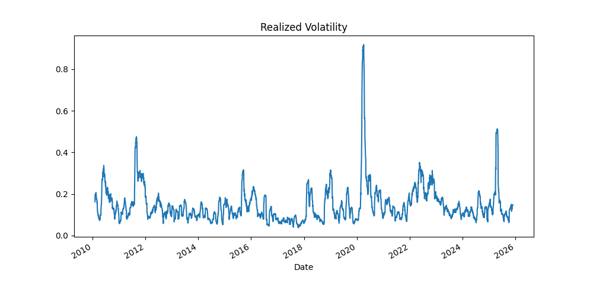
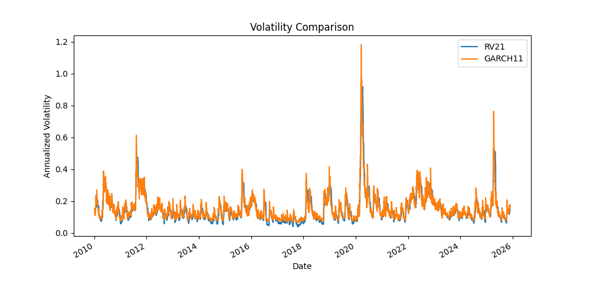
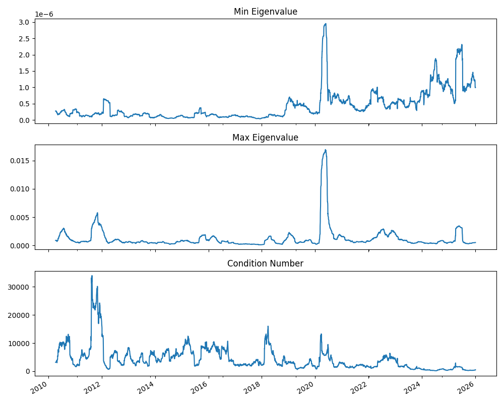
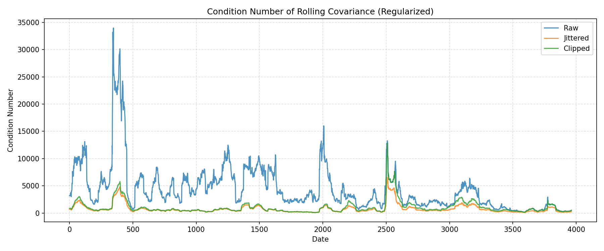

# Volatility and Covariance Baseline Lab (SPY + Liquid ETFs)

The goal of this project is to build baseline volatility and covariance plumbing in a clean, reproducible way using Python scripts.

This project's goal is not about modeling complexity or "alpha claims." Instead, I'm trying to work through:
- basic definitions (returns, realized volatility, sample covariance),
- comparisons (forecast vs realized proxy),
- numerical diagnostics (covariance fragility),
- project structure (scripts, configs, deterministic outputs).

**Focus:** volatility and covariance as risk objects.  
**Not included:** option pricing, Ito calculus, complex deep forecasting, or research-only abstractions.

---

## What this project includes

The project currently includes:
- Baseline volatility models compared to realized proxies
- Covariance treated as a potentially fragile risk object
- Conditioning diagnostics via eigenvalues and condition number
- SPD regularization techniques (diagonal jitter, eigenvalue clipping) with Cholesky validation
- Scripts with configs (not notebooks)
- Reproducible artifacts (figures saved to disk, deterministic paths)
- Unit tests for SPD repair functions

---

## Repo structure

```
spy-volatility-clustering-and-garch/
├── configs/                    # Configuration files
│   ├── default.yaml           # single-asset (SPY)
│   └── default_multivar.yaml  # multivariate prices for covariance diagnostics
│
├── data/                       # generated artifacts live here
│   ├── spy/                   # SPY price data storage
│   │   └── spy_prices.csv     # cached SPY prices
│   └── outputs/
│       └── figures/           # Visualization outputs
│           ├── SPY_log_returns.png
│           ├── SPY_realized_volatility.png
│           ├── SPY_GARCH11_VS_RV21.png
│           ├── prices_covariance_fragility.png
│           └── regularized_covariance_condition_number.png
│
├── datasets/                   # Additional datasets (if any)
│
├── notebooks/                  # Jupyter notebooks for analysis
│   └── volatility_basics.ipynb
│
├── scripts/                    # entrypoints (what gets run)
│   ├── test_load_spy.py
│   ├── print_config.py
│   ├── compute_returns_and_rv.py
│   ├── fit_garch.py
│   ├── diagnose_covariance.py
│   └── regulate_covariance.py
│
├── tests/                      # Unit tests
│   └── test_spd.py
│
├── src/                        # Source code
│   └── spy_volatility/        # Main package
│       ├── __init__.py
│       ├── data/              # Data loading and processing modules
│       │   ├── __init__.py
│       │   ├── loaders.py    # Yahoo Finance download + caching (single/multi-asset)
│       │   └── features.py   # returns + realized volatility
│       ├── models/            # GARCH and volatility models
│       │   ├── __init__.py
│       │   └── garch_models.py  # GARCH baselines (currently GARCH(1,1))
│       ├── risk/              # Risk metrics and portfolio analysis
│       │   ├── __init__.py
│       │   ├── cov_metrics.py   # rolling sample covariance + diagnostics
│       │   └── spd.py           # SPD regularization (jitter, eigenvalue clipping, Cholesky checks)
│       ├── training/          # Model training utilities
│       │   └── __init__.py
│       └── utils/             # Utility functions
│           ├── __init__.py
│           └── config.py     # config loading + project root
│
├── requirements.txt
├── setup.py
└── README.md
```

---

## Installation

```bash
git clone <repository-url>
cd spy-volatility-clustering-and-garch

python -m venv .venv
source .venv/bin/activate

pip install -U pip
pip install -r requirements.txt
pip install -e .
```

### Dependencies

- `pandas`, `numpy` (core)
- `matplotlib` (plots saved to disk)
- `yfinance` (data)
- `arch` (GARCH)
- `statsmodels` (future VAR work)
- `pyyaml` (configs)

---

## Configuration

Configs live in `configs/`.

- `default.yaml`: SPY single asset pipeline
- `default_multivar.yaml`: multivariate prices for covariance diagnostics

Example single-asset config:
```yaml
data:
  root_dir: "data"
  spy_prices_file: "data/spy/spy_prices.csv"
  spy_ticker: "SPY"
  start_date: "2010-01-01"
  end_date: null  # null = use today's date when running
```

Example multivariate config (used for covariance diagnostics):
```yaml
data:
  prices_file: "data/prices/multivar_prices.csv"
  ticker: ["SPY", "XLF", "XLK", "XLE", "XLY", "XLP", "XLI", "XLU", "XLV", "XLB"]
  start_date: "2010-01-01"
  end_date: null
```

---

## How to run (scripts only)

### 0) Sanity check config resolution
```bash
python scripts/print_config.py
```

### 1) Volatility clustering diagnostics (returns + RV)

The goal here is to compute log returns and an annualized realized volatility proxy (default RV(21)), then save figures.

```bash
python scripts/compute_returns_and_rv.py
```

**Outputs:**
- `data/outputs/figures/SPY_log_returns.png`
- `data/outputs/figures/SPY_realized_volatility.png`

**Results:** The figures illustrate volatility clustering and regime persistence, showing that squared returns and realized volatility exhibit the characteristic pattern where periods of high volatility cluster together.




### 2) GARCH(1,1) baseline vs realized volatility

The goal is to fit a GARCH(1,1) model and compare conditional volatility to RV(21).

```bash
python scripts/fit_garch.py
```

**Output:**
- `data/outputs/figures/SPY_GARCH11_VS_RV21.png`

**Results:** This comparison emphasizes the distinction between model-based forecasts (GARCH conditional volatility) and realized proxies (RV). The figure shows how the GARCH model captures volatility dynamics compared to the ex-post realized measure.



**Note:** this is a diagnostic comparison, not walk-forward evaluation yet.

### 3) Covariance fragility diagnostics

The goal is to compute rolling sample covariance matrices and check numerical properties over time.

```bash
python scripts/diagnose_covariance.py
```

**Output:**
- `data/outputs/figures/prices_covariance_fragility.png`

**Results:** The analysis shows that rolling sample covariance matrices for even liquid ETFs are often numerically fragile. Small eigenvalues approach zero (or even go negative numerically), and condition numbers spike dramatically in stressed periods, making these matrices unsafe for direct use in optimization or risk allocation.



### 4) SPD regularization

The goal is to apply explicit SPD (symmetric positive definite) regularization techniques to make covariance matrices numerically usable.

```bash
python scripts/regulate_covariance.py
```

**Output:**
- `data/outputs/figures/regularized_covariance_condition_number.png`

**Results:** This demonstrates that simple numerical fixes (diagonal jitter and eigenvalue clipping) dramatically improve covariance conditioning without changing the underlying estimator. The figure compares condition numbers for raw, jittered, and clipped covariance matrices over time, showing that explicit SPD repairs make covariance matrices safe for Cholesky decomposition and subsequent use in risk systems.



**Key insight:** In practical risk systems, the primary challenge is not estimating covariance, but making it numerically usable. Diagonal jitter stabilizes near-singular matrices by shifting the spectrum upward, while eigenvalue clipping enforces a hard lower bound and guarantees SPD by construction.

---

## Results and findings

The project follows a progression that builds understanding of volatility and covariance as practical risk objects:

1. **Volatility clustering visualization**: We begin by visualizing SPY log returns and realized volatility to illustrate volatility clustering and regime persistence. The figures show clear periods where high volatility clusters together, which is fundamental to understanding volatility dynamics.

2. **Forecast vs realized comparison**: We fit a GARCH(1,1) baseline and compare its conditional volatility to realized volatility, emphasizing the distinction between model-based forecasts and realized proxies. The comparison shows how GARCH captures volatility dynamics relative to ex-post measures.

3. **Covariance fragility demonstration**: Moving to the multivariate setting, we show that rolling sample covariance matrices for even liquid ETFs are often numerically fragile, with small eigenvalues and extreme condition numbers that make them unsafe for direct use. The diagnostics reveal that sample covariance can become ill-conditioned during stressed periods.

4. **SPD regularization results**: Finally, we demonstrate that simple, explicit SPD regularization techniques (diagonal jitter and eigenvalue clipping) substantially improve covariance conditioning. The results show that these minimal numerical repairs dramatically improve stability without changing the underlying estimator, highlighting that in practical risk systems the primary challenge is not estimating covariance, but making it numerically usable.

## Key concepts

### Forecast vs realized proxy

The goal is to keep these concepts distinct:
- **GARCH conditional volatility** is a model-based estimate (a forecast object).
- **Realized volatility (RV)** is a proxy built from future returns over a window (a realized object).

Keeping these distinct seems important in risk modeling.

### Covariance fragility and SPD regularization

The goal here is to understand that even for liquid ETFs, rolling sample covariance can become ill-conditioned and unstable. This project implements two production-style SPD repair techniques:
- **Diagonal jitter**: Stabilizes near-singular matrices by shifting the spectrum upward through a small diagonal addition.
- **Eigenvalue clipping**: Enforces a hard lower bound on eigenvalues and guarantees SPD by construction through eigendecomposition and reconstruction.

Both techniques are validated via Cholesky decomposition tests to ensure matrices are numerically usable. This is why production systems typically require SPD enforcement and numerical repairs before using covariance in risk allocation or optimization.

---

## Development notes

A few organizational choices I made:
- Library code lives in `src/spy_volatility/`.
- Scripts under `scripts/` are the official entrypoints.
- Generated artifacts go under `data/` (safe to delete and regenerate).
- `pip install -e .` is used for an editable install so scripts can import the package cleanly.
- Unit tests in `tests/` validate SPD repair functions with various edge cases (singular matrices, indefinite matrices, near-singular numerics).

## Next steps (planned)

Some things I'd like to add:
- Walk-forward evaluation (required before performance claims)
- VAR innovation covariance baseline
- Minimal risk application (vol targeting / risk parity) with turnover reporting
- Extended testing of regularization techniques on various market conditions

---

## License

TBD

## Author

Jim Lim
